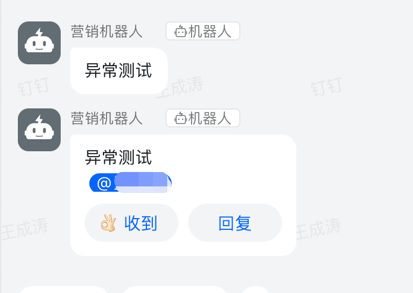
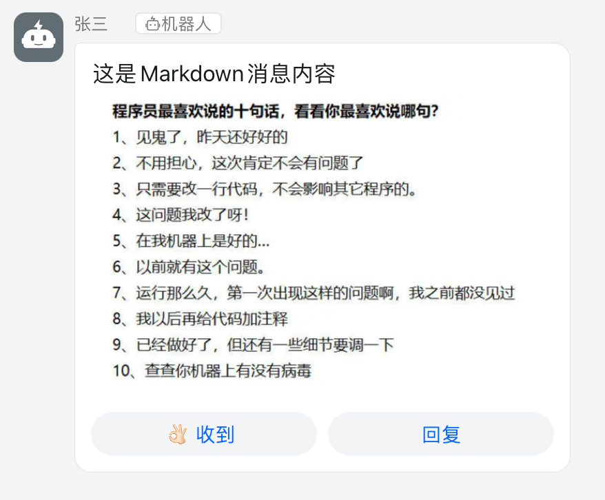

## 消息通知组件

## 功能
* 支持多种通道(钉钉群机器人 飞书群机器人)
* 支持扩展自定义通道

## 环境要求
* laravel >= 6.0

## 安装
```bash
composer require wangchengtao/laravel-exception-notify
```

## 配置
1. 创建配置文件:
```shell
php artisan vendor:publish --provider="Summer\LaravelExceptionNotify\ExceptionNotifyServiceProvider"
```
2. 修改 `config/message.php` 中对应的参数即可

## 使用
```php
use Summer\ExceptionNotify\Message\Dingtalk\DingtalkMarkdown;
use Summer\LaravelExceptionNotify\Notify;

// 文本格式
$text = new DingtalkText();
$text->setTitle('测试');
$text->setContent('异常测试');
$text->setAt([
    '187*****897',
]);

Notify::send($text);

// markdown 格式
$markdown = new DingtalkMarkdown();
$markdown->setTitle('Markdown消息标题');
$markdown->setContent("#### 这是Markdown消息内容 \n ");
$markdown->atAll();

Notify::send($markdown);
```

## 效果图



## 自定义通道
* 所有自定义通道继承自 `AbstractChannel`
* 所有自定义消息继承自 `AbstractMessage`

```php
use Summer\ExceptionNotify\Channel\AbstractChannel;
use Summer\ExceptionNotify\Message\AbstractMessage;
use Summer\LaravelExceptionNotify\Notify;

class CustomChannel extends AbstractChannel
{
    public function handleResponse(ResponseInterface $response): void
    {
        // TODO: Implement getBody() method.
    }
    
    public function send(string $content): ResponseInterface
    {
        // TODO: Implement getBody() method.
    }
}

class CustomMessage extends AbstractMessage
{
    public function getBody() : array
    {
        // TODO: Implement getBody() method.
    }
}

```
在 `config/message.php` 中添加相应配置
```php
return [
    'default' => env('NOTIFY_DEFAULT_CHANNEL', 'dingtalk'),
    'channels' => [
        // 已省略其它配置
        'custom' => [
            'driver' => CustomChannel::class,
            //
        ],
    ],
];

```

发送消息
```php
$message = new CustomMessage();
$message->setTitle('自定义标题');
$message->setContent('自定义消息');

Notify::channel('custom')->send($message);
```